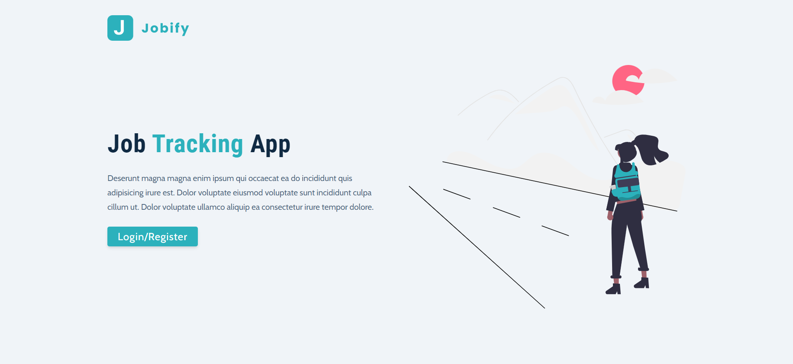
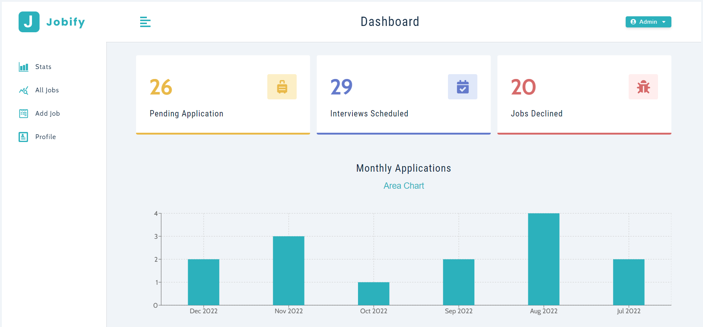
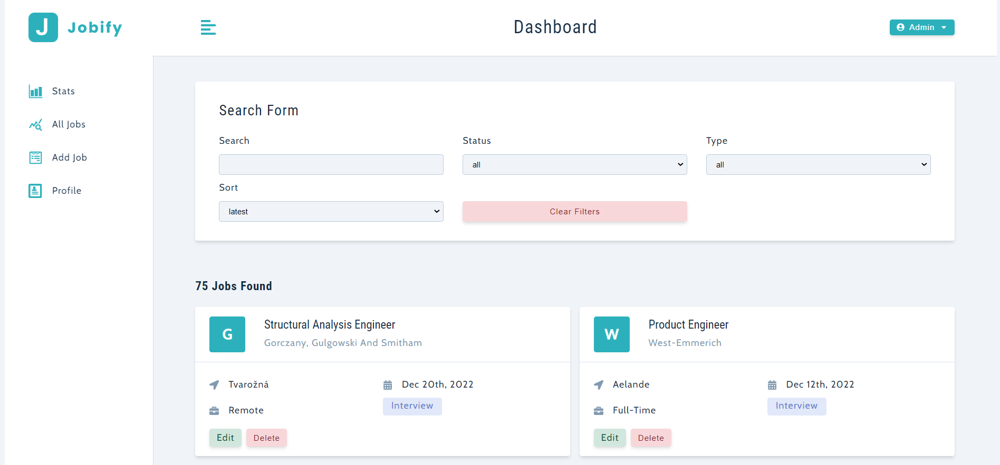

# Jobify-fullstack

## Table of Contents
* [Overview](#overview)
* [Project Screenshot](#screenshots)
* [Installation](#installation)
* [Reflection](#reflection)
* [References](#references)
* [Author](#author)

# Overview
A JavaScript full stack application for managing job applications to keep track. It is build using React for frontend, Node and express for backend and MongoDB as a database.

## Screenshots
 
 
 

### You can watch Live demo [_here_](https://jobify-lri3.onrender.com).

## Installation

Clone down this repository. You will need `node` and `npm` installed globally on your machine.  

Installation:

`npm install`  

To Start Server:

`npm start`  

To Visit App:

`localhost:3000`  

## Reflection
In this application, I learned to connect frontend and backend. Also, I learned to communicate with backend from frontend. Learned Implemented authentication on backend so only register users can login and use the app. I got full experience for developing full stack app from scratch from designing to developing.

While building this application, I learned to handle errors and respont to them.

## References
- [Styled Component](https://styled-components.com/)
- [React](https://reactjs.org/docs/getting-started.html)
- [Node](https://nodejs.org/en/)
- [Express](https://expressjs.com/)
- [MongoDB](https://www.mongodb.com/)
- [Mongoose](https://mongoosejs.com/)

## Author

[Website](https://kedarmakode.com/)

[Linkedin](https://www.linkedin.com/in/kedar-makode-9833321ab)

[Twitter](https://twitter.com/Kedar__98)

[Instagram]()

kedarmakode1598@gmail.com

